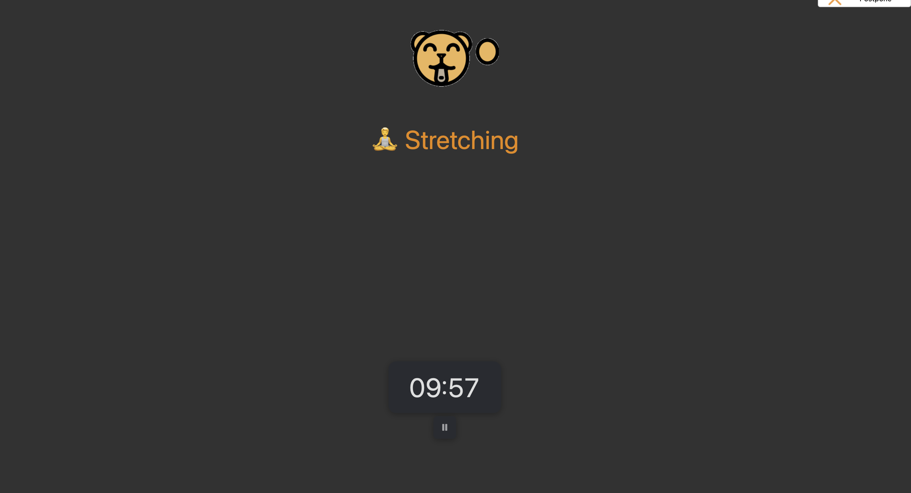

# Reflection

## What equipment changes can you make to improve your workspace setup? (e.g., using an external monitor, adjusting your chair, using a laptop stand)
I could use a laptop stand to raise my screen closer to eye level and use an external keyboard and mouse so I’m not leaning forward as much. I could also make sure my chair is adjusted so my feet are supported and my arms can rest comfortably while typing.

## What behavioural changes can you implement to improve posture and reduce strain? (e.g., sitting upright, taking regular breaks, adjusting screen height)
I can be more conscious of sitting upright instead of hunching over my laptop, and take regular breaks to stand up, stretch and move around. I can also change positions throughout the day instead of staying in the same position for hours.

## How can you remind yourself to maintain good posture and take breaks throughout the day? (Hint: Use Focus Bear to schedule movement breaks!)
I can use Focus Bear to schedule regular movement or stretching breaks throughout my work sessions. I could also use the breaks as a reminder to check my posture and readjust my chair or screen if needed.

# Tasks

## Adjust your laptop setup based on ergonomic best practices.

## Identify at least one piece of equipment that could improve your posture and comfort.
A device that elevates my laptop screen or an external monitor so that my eyes are at level with the screen, so I don't have to bend down.

## Try using posture and movement reminders for a full workday and note any improvements. (Hint: Focus Bear has built-in reminders for movement breaks!)
I used Focus Bear's micro breaks tool throughout a full workday to remind myself to move and check my posture. During each break, I stood up, stretched or walked around briefly, and readjusted my posture before returning to work. Using these micro breaks helped me avoid sitting in the same position for long periods and made me more conscious of my posture throughout the day. By the end of the day, I noticed that I was standing up more regularly and checking my posture more often instead of only adjusting it once I became uncomfortable.

## Document at least one workspace change or habit adjustment you made.
I now use an external monitor positioned closer to eye level, which reduces how much I need to look down while working. I also started using Focus Bear's movement reminders as a regular cue to stand up and check my posture throughout the day.